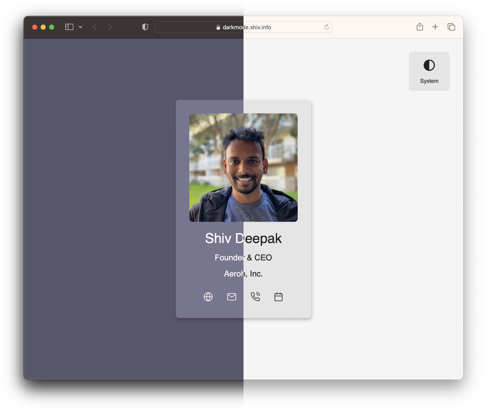

# Dark Mode Controller in React

This project demonstrates how Dark Mode setting should be setup for a user.

## Features

It support three color scheme modes:

1. Dark Mode
2. Light Mode
3. System (Inherit System Settings)

User defined color scheme is stored in Local Storage.

Moreover, if the user has several tabs open, and color scheme is change on one tab, a shared service worker is used to sync the color scheme settings across all other tabs.

## Demo Site

Visit [darkmode.shiv.info](https://darkmode.shiv.info) for a Live Demo.

## Screenshots

**System**

**Dark Mode**

**Light Mode**

